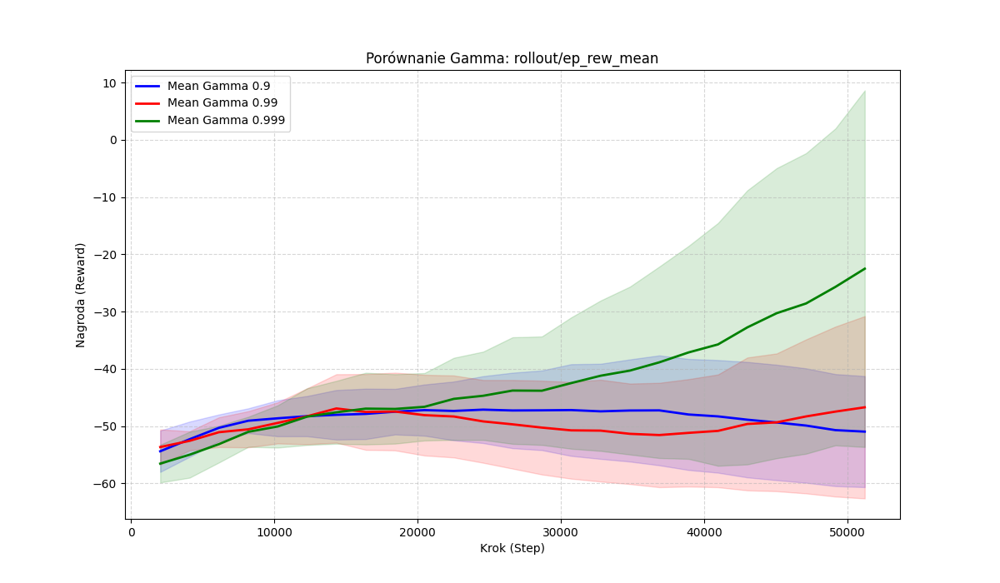
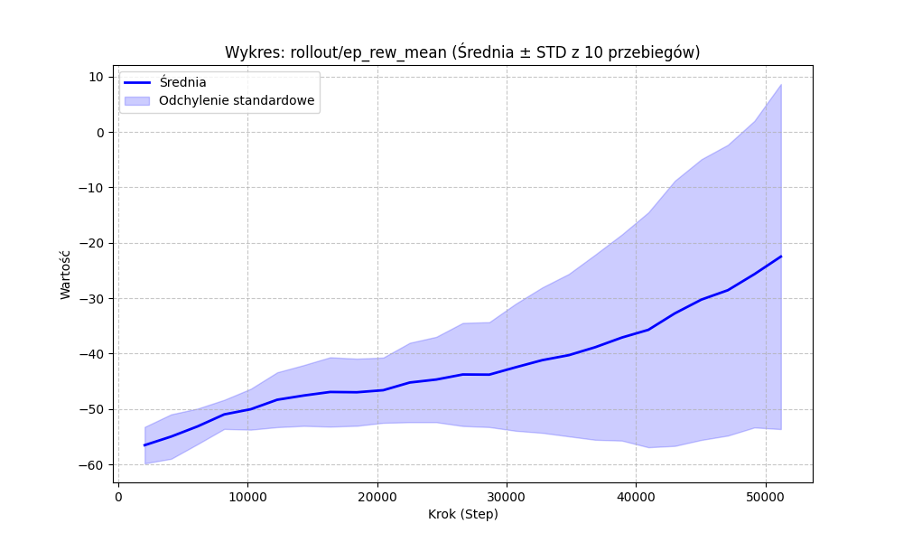
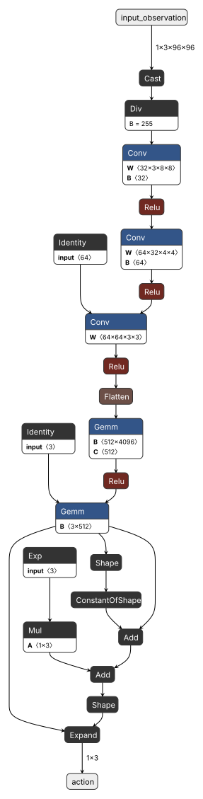
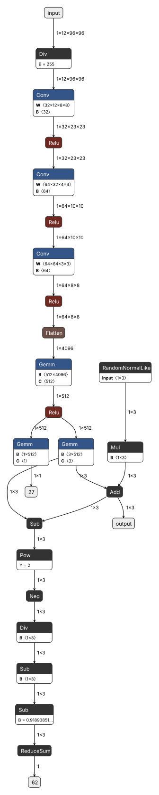

# Sprawozdanie: Uczenie przez wzmacnianie w przestrzeniach ciągłych

## 1. Autorzy
- Paweł Knot
- Jarosław Klima

---

# Na 4 pkt

## 2. Środowisko: CarRacing

### 2.1. Opis środowiska
- Nazwa środowiska: CarRacing-v3
- Typ przestrzeni akcji:
	- ciągła (`continuous=True`)
	- w eksperymentach użyto polityki obsługującej sterowanie ciągłe
- Obserwacje:
	- obraz RGB o stałym rozmiarze zwracany jako kolejne klatki
	- frame stacking (`n_stack=4`) w celu uchwycenia dynamiki ruchu pojazdu
	- testowo sprawdzano także wariant z grayscale, ale nie poprawił wyników

### 2.2. Cel agenta
- Maksymalizacja średniej nagrody epizodu
- Stabilna jazda po torze bez wypadania poza asfalt
- Płynne pokonywanie zakrętów i unikanie oscylacji sterowania

### 2.3. Miary oceny
- `eval/mean_reward`
- `rollout/ep_rew_mean`
- `eval/mean_ep_length`
- `rollout/ep_len_mean`
- Dodatkowo jakościowo: obserwacja przejazdu modelu w trybie renderowania

### 2.4. Czas działania środowiska
- Jedno uruchomienie środowiska i wykonanie kroku czasowego było na tyle szybkie, że główny koszt eksperymentu stanowił trening i okresowe ewaluacje.
- W praktyce czas jednego epizodu był silnie zależny od tego, czy agent utrzymywał się na torze przez dłuższy czas, czy kończył jazdę wcześniej.

---

## 3. Rozwiązanie problemu z PPO

### 3.1. Dlaczego PPO
- Stabilność uczenia dzięki mechanizmowi clipping
- Dobre działanie dla zadań sterowania ciągłego
- Mniejsza wrażliwość na pojedyncze niestabilne aktualizacje niż A2C

### 3.2. Konfiguracja bazowa PPO
- Policy: `CnnPolicy`
- gamma: 0.99 (bazowo)
- środowisko: `CarRacing-v3` w trybie continuous
- opakowanie środowiska: `Monitor` + `DummyVecEnv` + `VecFrameStack(n_stack=4)`
- eval callback: `eval_freq=10000`, `n_eval_episodes=10`, `deterministic=True`
- budżet uczenia: `total_timesteps=500000`
- logging: `monitor.csv` + TensorBoard

Krzywa uczenia: średnia nagroda z ewaluacji na przestrzeni kolejnych epok treningu:

Krzywa uczenia: odchylenie standardowe obliczone na podstawie 10 uruchomień:

### 3.3. Wyniki bazowe PPO
Uczenie PPO przebiegało stabilnie: po początkowej fazie eksploracji model stopniowo zwiększał średnią nagrodę, a krzywa ewaluacyjna miała wyraźny trend rosnący.

Najlepszy wariant PPO (`gamma=0.99`) osiągał najwyższe wartości `eval/mean_reward` spośród wszystkich testów i wyraźnie przewyższał warianty z `gamma=0.9` oraz `gamma=0.999`.

Po treningu agent jechał płynnie po torze, lepiej utrzymywał się na drodze i rzadziej wpadał w oscylacje sterowania.

W modelu nie występowało wyraźne przeuczenie, ponieważ wyniki uzyskiwane podczas treningu i ewaluacji były ze sobą zbieżne.

---

# Na 6 pkt

## 4. Architektury sieci wykorzystywanych przez agenta

### 4.1. Opis wejścia i wyjścia
- Wejściem sieci jest obserwacja środowiska CarRacing-v3 po przetworzeniu do postaci obrazu RGB z buforem czterech ostatnich klatek.
- Sieć analizuje więc zarówno aktualny stan toru, jak i krótki kontekst ruchu pojazdu.
- Wyjściem polityki jest akcja sterująca pojazdem w przestrzeni ciągłej, czyli trzy składowe odpowiadające za skręt, gaz i hamulec.

### 4.2. Architektura A2C
Schemat sieci wykorzystanej przez A2C:

	

Model A2C przyjmuje wejście `float32[1,3,96,96]`. Najpierw przechodzi przez ekstraktor cech z trzema warstwami konwolucyjnymi o filtrach `32x12x8x8`, `64x32x4x4` i `64x64x3x3`, każda z aktywacją `ReLU`. Następnie występują warstwa `Flatten` i warstwa gęsta `512` z `ReLU`. Na końcu sieć rozdziela się na głowę polityki i głowę wartości. Wyjście akcji ma wymiar `1x3`, a wyjście krytyka `1`.

### 4.3. Architektura PPO
Schemat sieci wykorzystanej przez PPO:

	

Architektura PPO ma ten sam układ warstw, ale wejście ma postać `float32[1,12,96,96]`, ponieważ do obrazu dołączono cztery ostatnie klatki. Ekstraktor cech ma te same trzy warstwy konwolucyjne i warstwę gęstą `512` z `ReLU`. Na wyjściu model zwraca akcję o wymiarze `1x3` oraz wartość stanu o wymiarze `1`.

## 5. Porównanie architektur
- Obie sieci przyjmują ten sam typ wejścia i pracują na tej samej obserwacji środowiska.
- Różnica dotyczy sposobu aktualizacji i stabilności uczenia, a nie samego formatu danych wejściowych.
- PPO okazało się wyraźnie skuteczniejsze, mimo że sama architektura sieci była zbliżona do tej używanej przez A2C.

---

# Na 8 pkt

## 6. Symulacja najlepszego modelu

Symulację wykonano z wyłączonym trybem eksploracji, więc agent działał deterministycznie i w każdej sytuacji wybierał najlepszą akcję wynikającą z wyuczonej polityki. Pomiar przeprowadzono na 5 epizodach.

Średnia nagroda wyniosła `242.17 +/- 114.15`, pomiar przeprowadzoną na 5 przebiegach.

## 7. Wnioski

Przeprowadzone eksperymenty pokazują, że dla środowiska CarRacing-v3 najlepszym wyborem okazał się PPO. Algorytm ten zapewnił wyraźnie lepszą stabilność uczenia niż A2C, a najlepsze wyniki uzyskano dla `gamma=0.99`, które dawało dobry kompromis między reagowaniem na bieżący stan toru a uwzględnianiem dłuższego horyzontu nagrody. Zbyt małe `gamma` prowadziło do decyzji krótkowzrocznych, a zbyt duże utrudniało stabilizację procesu uczenia.

Ważnym wnioskiem jest także to, że sama architektura sieci nie była głównym ograniczeniem. Obie sieci korzystały z podobnego ekstraktora cech, ale decydujące znaczenie miała metoda optymalizacji polityki. PPO lepiej radziło sobie z danymi obrazowymi, ciągłą przestrzenią akcji i opóźnionymi skutkami decyzji niż A2C.

Deterministyczna symulacja najlepszego modelu potwierdziła, że zapisany agent rzeczywiście potrafi działać po zakończeniu treningu. Uzyskana średnia nagroda `242.17 +/- 114.15`.

Najważniejszym ograniczeniem eksperymentu pozostał budżet obliczeniowy oraz ograniczona liczba powtórzeń z różnymi inicjalizacjami. Z tego powodu przedstawione wyniki należy traktować jako solidne porównanie wybranych konfiguracji, ale nie jako pełne przeszukanie całej przestrzeni hiperparametrów.